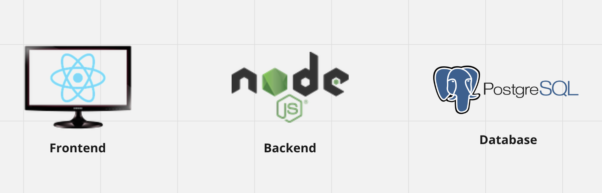
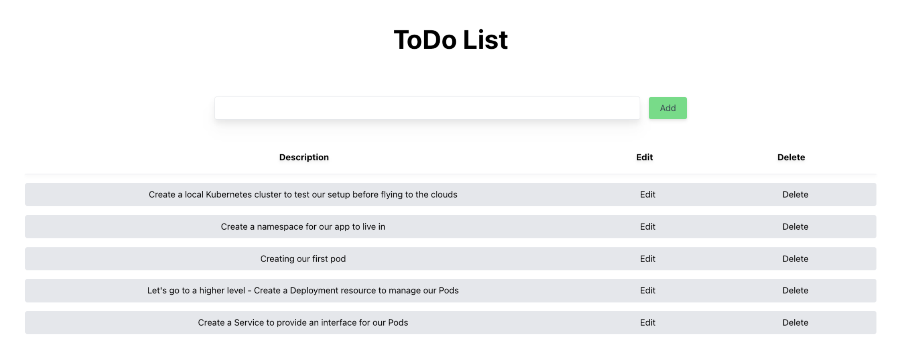
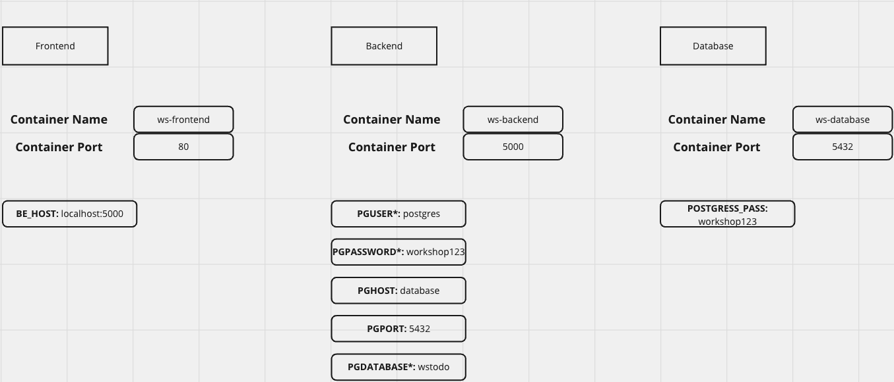

# Pre-Requisites

## Install the following tools:

The versions are the ones that I have currently installed, they are just for reference and not obligatory.

- Git (https://git-scm.com/downloads) (Version: 2.44.0)
- Docker (https://www.docker.com/) (Engine: 25.0.3; Server: 4.28.0)
- Local Kubernetes Cluster (Kind, Minikube)
- kubectl (Version: 1.27)
- Helm (https://helm.sh/docs/intro/install/)(Version: v3.12.0)

## Accounts

- GitHub Account (https://github.com/)
- DockerHub Account (https://hub.docker.com/)

<br>
<br>

## Running with Kind

If you use kind for this workshop create it with Ingress support.

[Kind config with ingress support](https://dustinspecker.com/posts/test-ingress-in-kind/)

```
kind: Cluster
apiVersion: kind.x-k8s.io/v1alpha4
nodes:
  - role: control-plane
    kubeadmConfigPatches:
      - |
        kind: InitConfiguration
        nodeRegistration:
          kubeletExtraArgs:
            node-labels: "ingress-ready=true"        
    extraPortMappings:
      - containerPort: 80
        hostPort: 80
        protocol: TCP
      - containerPort: 443
        hostPort: 443
        protocol: TCP
```


## Optional

- kubectx and kubens (https://github.com/ahmetb/kubectx)

<br>
<br>

# The App!

## Components



## What we're building



## Docker



[Front end](https://github.com/r-magalhaes/ws-frontend)

[Back end](https://github.com/r-magalhaes/ws-backend)

[Database](https://github.com/r-magalhaes/ws-database)


## Setup

- Navigate to a directory of your chosing to host the repositories

```git clone https://github.com/r-magalhaes/ws-frontend```

```git clone https://github.com/r-magalhaes/ws-backend```

```git clone https://github.com/r-magalhaes/ws-database```


<br>
<br>

# The Problem...

We've been managing the deployment of this application on-premise. So far this app is been used inside of your organisation which made it pretty simples to manage all around. You've dockarized the Front-end, Back-end and even the Database. Now your organisation decided to launch the app online for other people to use it.

Some things to take into consideration:
- You're aware you'll need to have control over increasing/decreasing load when the App goes live
- The App is still somewhat raw which means new updates will arrive and you want to have a system in place to have automated deployments
- You also want to take advantage of the dockerized images you already have

You've chosen to use Kubernetes as the container orchestration tool!